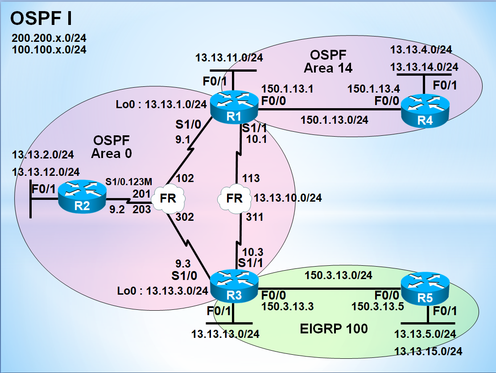

# OSPF Advanced Study (OSPF 심화)

> Cisco 라우터 기반 OSPF 심화 개념 실습 정리  
> Frame-Relay 환경에서의 OSPF 동작, LSA-Type, Stub Area, NSSA, 경로 요약(Summary)까지 단계별 학습

---

## 📌 개요 (Overview)

본 저장소는 **OSPF 심화 개념**을 Dynamips + SecureCRT 환경에서 실습한 내용을 정리한 자료입니다.  
Frame-Relay 환경에서의 OSPF Network-Type 변경, Multi-Area 구성, LSA-Type 분석, Stub 계열 Area 구성,  
ABR/ASBR에서의 경로 요약(Summarization)까지 단계별로 실습합니다.

---

## 🛠️ 실습 환경 (Environment)

| 항목 | 내용 |
|------|------|
| Emulator | Dynamips / GNS3 |
| Terminal | SecureCRT |
| IOS | Cisco c3725 (Advanced Enterprise) |
| Topology | R1 ~ R5 (Frame-Relay Hub & Spoke + Multi Area) |
| Protocol | OSPF, EIGRP, RIPv2 (재분배 실습) |

---

## 🗂️ 목차 (Chapters)

| 챕터 | 제목 | 주요 내용 |
|------|------|----------|
| [01](./chapters/01-Pre-Configuration.md) | Pre-Configuration | R1~R5 기본 인터페이스 및 Frame-Relay 구성 확인 |
| [02](./chapters/02-OSPF-FrameRelay-Area0.md) | OSPF Frame-Relay 구성 | Area 0, Point-to-Multipoint, DR/BDR 제어 |
| [03](./chapters/03-DR-BDR-Control.md) | DR/BDR 선출 제어 | Priority 설정, neighbor 명령 |
| [04](./chapters/04-R1-R3-FrameRelay.md) | R1-R3 Frame-Relay 구간 | Point-to-Point Network Type |
| [05](./chapters/05-Area14-Config.md) | OSPF Multi-Area (Area 14) | ABR 구성, Point-to-Point 적용 |
| [06](./chapters/06-EIGRP-Config.md) | EIGRP 구성 | EIGRP 100 (R3-R5) |
| [07](./chapters/07-Loopback-NetworkType.md) | Loopback Network Type | /32 → /24 광고 |
| [08](./chapters/08-Reference-Bandwidth.md) | Reference-Bandwidth | 메트릭 정확성 확보 |
| [09](./chapters/09-LSA-Type.md) | LSA-Type 분석 | Type 1 ~ Type 7 구분 |
| [10](./chapters/10-Redistribution.md) | OSPF ↔ EIGRP 재분배 | ASBR 구성 |
| [11](./chapters/11-Stub-Area.md) | Stub Area | LSA Type 4, 5 차단 |
| [12](./chapters/12-Totally-Stub.md) | Totally Stub Area | LSA Type 3, 4, 5 차단 |
| [13](./chapters/13-NSSA.md) | NSSA | ASBR 포함 Area의 Stub화 (Type-7) |
| [14](./chapters/14-Totally-NSSA.md) | Totally NSSA | NSSA + Inter-Area 차단 |
| [15](./chapters/15-OSPF-Summary.md) | OSPF 경로 요약 | `area range` / `summary-address` |
| [16](./chapters/16-Pre-Config-All.md) | 전체 Pre-Config | R1~R5 초기 설정 전체 |

---

## 🧩 토폴로지 구성

---

## 📚 학습 포인트 (Key Takeaways)

- OSPF Network Type에 따른 DR/BDR 선출 제어 (`point-to-multipoint`, `point-to-point`)
- `passive-interface default` 를 활용한 LSA 송신 최소화
- `auto-cost reference-bandwidth` 를 활용한 메트릭 정확성 확보
- LSA-Type 별 전파 범위 및 차단 메커니즘 이해
- Stub / Totally Stub / NSSA / Totally NSSA의 차이점
- ABR의 `area range`, ASBR의 `summary-address` 활용한 경로 요약

---

## 🏷️ Tags / Topics

`cisco` `ospf` `ospf-advanced` `frame-relay` `dynamips` `gns3`  
`networking` `ccnp` `ccie` `lsa` `stub-area` `nssa`  
`route-summarization` `redistribution` `eigrp` `routing-protocol`

---

## 📖 Reference

- Cisco OSPF Configuration Guide
- RFC 2328 (OSPF Version 2)
- RFC 3101 (OSPF NSSA Option)

---

## 👤 Author

**KSNAM97**  
🔗 [GitHub Profile](https://github.com/KSNAM97)
